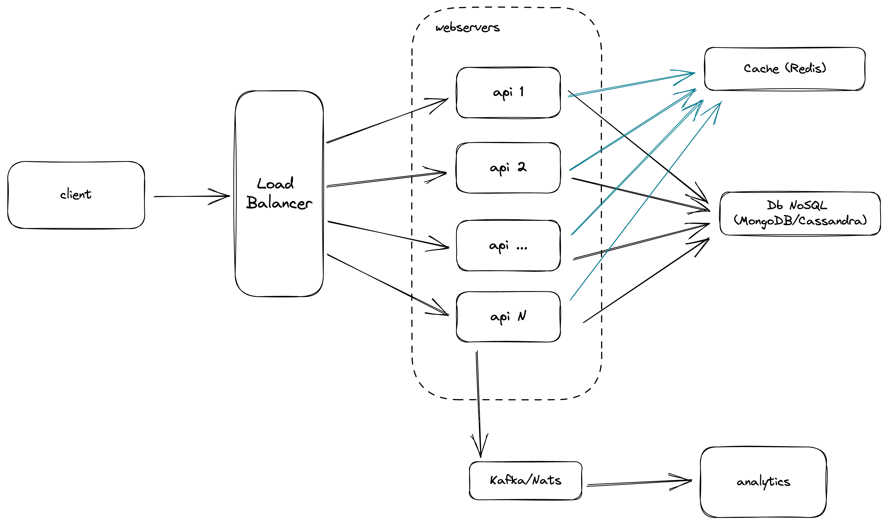

# Acortador de url

Propuesta de arquitectura para el problema de generar un acortador de url.

## Requisitos del sistema

### Funcionales

- El sistema es capaz de generar una url acortada desde una url.
- Al ingresar a la url acortada, el usuario es redirigido a la url original.
- Se puede modificar la url original de la url acortada.
- Se puede habilitar o deshabilitar la url acortada.
- Analiticas de las urls acortadas.

### No funcionales

- El sistema debe ser escalable.
- El sistema debe ser tolerante a fallos.
- Alta disponibilidad.

## Diagrama



### Componentes

#### Load balancer (Balanceador de carga)

Se pondrían delante de los servidores de aplicación. Se encarga de distribuir la
carga entre las distintas instancias de la api.

Para el caso del balanceador de carga frente a los servidores de aplicación se
configuraría
a usar **least connection method**. Esto es para que se distribuya la carga
entre las distintas
instancias de la api. De esta forma selecciona la instancia con menos conexiones
activas.

Adicionalmente, se podrían ubicar también delante de los servidores de base de
datos y de la caché si fuera necesario.

#### Web servers (Servidores web/Backend)

Para poder dar alta disponibilidad, se deben tener varias instancias del
servidor web corriendo. En caso de que alguno no pueda responder, el balanceador
de carga se encarga de redirigir la carga a otro servidor web.

#### Db servers (Base de datos)

Para la base de datos se recomienda una base de datos no relacional como
Cassandra o mongoDB.

Para esta ocasión en producción se recomienda usar Cassandra.
[Ver los detalles de elección y consideraciones tomadas acá](./docs/base-de-datos.md)

#### Cache servers (servidores de caché)

Para escalar la resolución de las urls acortadas, se agregan servidores de caché
donde almacenar en memoria las urls acortadas. De esta forma se evita ir a la
base
de datos cada vez que se resuelve una url acortada.

Los elementos en la caché se invalidan cuando se modifica la url original y se
configura
una evict policy para que se eliminen los elementos menos usados recientemente
(LRU).

Para base de datos se puede utilizar redis o memcached, ambas son muy rápidas y
escalables.

#### Analytics (Estadísticas de acceso)

Para poder mantener métricas de las urls, se agrega un componente de
mensajería/streaming con el propósito de mantener un registro de la actividad e
ir notificando a sistemas que ya se encuentren en producción.

De esta manera el sistema queda independiente de lo que quieran hacer con las
estadísticas/métricas de acceso de las url.

Acá se puede utilizar Kafka o NATS.

Registros que se pueden ir guardando en el sistema de mensajería:
- Registro de cada vez que se resuelve una url acortada.
- Registro de cada vez que se modifica la url original de una url acortada.
- Registro de cada vez que se habilita o deshabilita una url acortada.
- Registro de cada vez que se crea una nueva url acortada.

Cada uno de estos registros/eventos se pueden ir guardando en un tópico.

## Generación del hash/key

Para ver el detalle de la generación del hash, ver [acá](./docs/generar-shorl-url.md)

## API

La aplicación expone una API REST para poder interactuar con el sistema.

### Endpoints

#### Crear una url acortada

```http request
POST http://localhost:5001

{
  "url": "https://www.google.cl/search?q=gatos"
}
```

#### Resolución de una url acortada

```http request
GET http://localhost:5001/hzxNpvI0o0
```

#### Modificar la url original de una url acortada

```http request
PUT http://localhost:5001/hzxNpvI0o0

{
  "originalUrl": "https://www.google.com/search?q=perros"
}
```

#### Habilitad una url acortada

```http request
PUT http://localhost:5001/hzxNpvI0o0

{
  "enabled": true
}
```

#### Deshabilitar una url acortada

```http request
PUT http://localhost:5001/hzxNpvI0o0

{
  "enabled": false
}
```
