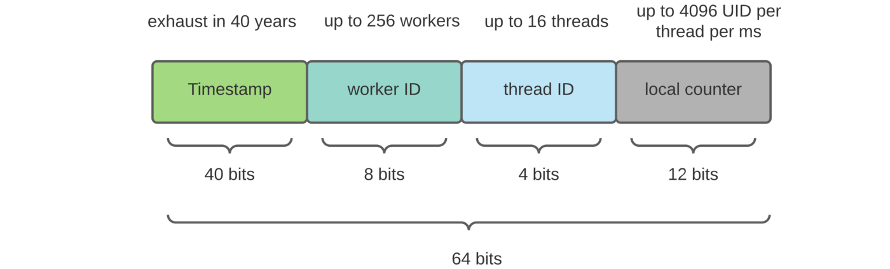
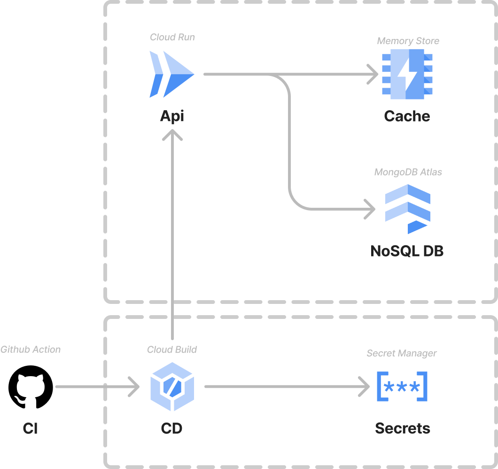

# Acortador de url

Propuesta de arquitectura para el problema de generar un acortador de url.

## Requisitos del sistema

### Funcionales

- El sistema es capaz de generar una url acortada desde una url.
- Al ingresar a la url acortada, el usuario es redirigido a la url original.
- Se puede modificar la url original de la url acortada.
- Se puede habilitar o deshabilitar la url acortada.
- Analiticas de las urls acortadas.

### No funcionales

- El sistema debe ser escalable.
- El sistema debe ser tolerante a fallos.
- Alta disponibilidad.

## Diagrama


### Componentes

#### Load balancer (Balanceador de carga)

Se pondrían delante de los servidores de aplicación. Se encarga de distribuir la
carga entre las distintas instancias de la api.

Para el caso del balanceador de carga frente a los servidores de aplicación se
configuraría
a usar **least connection method**. Esto es para que se distribuya la carga
entre las distintas
instancias de la api. De esta forma selecciona la instancia con menos conexiones
activas.

Adicionalmente, se podrían ubicar también delante de los servidores de base de
datos y de la caché si fuera necesario.

#### Web servers (Servidores web/Backend)

Para poder dar alta disponibilidad, se deben tener varias instancias del
servidor web corriendo. En caso de que alguno no pueda responder, el balanceador
de carga se encarga de redirigir la carga a otro servidor web.

#### Db servers (Base de datos)

Para la base de datos se recomienda una base de datos no relacional como
Cassandra o mongoDB.

Para esta ocasión en producción se recomienda usar Cassandra. Para los detalles de la elección revisar [Base de datos: elección](#base-de-datos-elección)

#### Cache servers (servidores de caché)

Para escalar la resolución de las urls acortadas, se agregan servidores de caché
donde almacenar en memoria las urls acortadas. De esta forma se evita ir a la
base
de datos cada vez que se resuelve una url acortada.

Los elementos en la caché se invalidan cuando se modifica la url original y se
configura
una evict policy para que se eliminen los elementos menos usados recientemente
(LRU).

Para base de datos se puede utilizar redis o memcached, ambas son muy rápidas y
escalables.

#### Analytics (Estadísticas de acceso)

Para poder mantener métricas de las urls, se agrega un componente de
mensajería/streaming con el propósito de mantener un registro de la actividad e
ir notificando a sistemas que ya se encuentren en producción.

De esta manera el sistema queda independiente de lo que quieran hacer con las
estadísticas/métricas de acceso de las url.

Acá se puede utilizar Kafka o NATS.

Registros que se pueden ir guardando en el sistema de mensajería:

- Registro de cada vez que se resuelve una url acortada.
- Registro de cada vez que se modifica la url original de una url acortada.
- Registro de cada vez que se habilita o deshabilita una url acortada.
- Registro de cada vez que se crea una nueva url acortada.

Cada uno de estos registros/eventos se pueden ir guardando en un tópico.

## Generación del hash/key

Como identificador único se decidió utilizar un hash en base 62 (letras y
números). Este hash se genera codificando un número en base 62.

El número base utilizado es un identificador único basado en el timestamp
utilizando un
algoritmo inspirado
en [Twitter Snowflake](https://blog.twitter.com/2010/announcing-snowflake) que
se encarga de generar un
número único para cada registro.

El identificador generado tiene una estructura similar a la siguiente



Aunque la cantidad de bits utilizados es menor.

Para la implementación del código se utilizó la
librería [Snowflake-UUID](https://github.com/rakheyl/snowflake-uuid) para
realizar el cálculo del identificador snowflake.

Esto está generando hash únicos similares al siguiente después de hacer la
codificación en base 62: `hxT2nmtIrK`

Si se necesitarán menos caracteres para el hash, se puede realizar una
implementación
personalizada de la librería o ir ajustando los parámetros de la librería.

### Ventajas

- No se requiere una base de datos para almacenar los identificadores o un
  contador
  global.
- No se tiene que preocupar por la cantidad de registros que se generen. La
  operación de generar un identificador es constante.

### Desventajas

- El identificador generado es predecible. Si se conoce el timestamp del
  registro se puede predecir el identificador generado.
- Se requiere de pasar correctamente los parámetros que entregan la
  característica
  de único del identificador. Como lo son el worker id y el datacenter id (en la
  librería utilizan el datacenter id en vez del thread id que se ve en la
  imagen).

### Opciones que se consideraron

Las siguientes opciones se tomaron en cuenta para la generación del hash:

#### Generar el hash de manera aleatoria

- Se generan X caracteres aleatorios y se verifica que no exista en la base de
  datos.
- Si existe, se vuelve a generar el hash.
- Si no existe, se guarda en la base de datos.

##### Ventajas:

- Es la opción más sencilla de implementar.
- No requiere de un algoritmo de hash o enconding.

##### Desventajas:

- Los costos de generar un hash único aumentan a medida que la base de datos
  crece.
- Los tiempos de respuesta aumentan a medida que la base de datos crece.
- Cada vez cuesta más encontrar un hash único.

##### Escalar esta opción

Para escalar esta opción se puede mover esta generación de hash a un servicio
aparte que se encargue de generar los hashes únicos. Este servicio puede ser
escalado de manera independiente a la base de datos.

Por ejemplo podría pre-calcular los hashes y guardarlos en una base de datos.
Luego cuando se le consulté por un hash, se le devolvería el hash que se
encuentre disponible en la base de datos de hashes pre-calculados.

El tema es que no evitas el problema de que cada vez cuesta más encontrar un
hash único. Cada vez es más costoso encontrar un hash único. Necesitas tener
poder de cómputo para generar los hashes aunque lo hagas fuera del hilo de
ejecución principal y el usuario ni se entere.

## Base de datos: elección

### Consideraciones generales

* Se espera una gran cantidad de volumen de datos, operaciones de lectura y
  escritura que se esperan.
* Las operaciones de lectura son más comunes en comparación con las operaciones
  de escritura. No es extraño encontrar relaciones tipo 100:1 (100 lecturas por
  cada escritura).
* Debe ser escalable y tolerante a fallos.
* Altamente disponible.

### SQL vs NoSQL

Si bien se puede utilizar SQL para almacenar datos, no es la mejor opción para
el caso de uso de la aplicación. La razón es que la aplicación no tendrá
consultas complejas donde se requiera un lenguaje de consulta estructurado.
Además, la aplicación no tendrá relaciones entre las entidades, por lo que no se
requiere un modelo relacional y si las relaciones existen, no deberían ser
complejas.

Por otro lado, para cumplir con las consideraciones generales, como la alta
disponibilidad y escalabilidad, una base de datos NoSQL es la mejor opción.
Esto se debe a que las bases de datos NoSQL están diseñadas para escalar de
forma horizontal de manera sencilla.

La gran cantidad de datos y el alto volumen de lectura, también es otro punto a
favor por el cual se debe utilizar una base de datos NoSQL.

Opciones comunes para bases de datos NoSQL son: **MongoDB** y **Cassandra**.

### Comparativa: Mongodb vs Cassandra

Ambas bases de datos son buenas opciones para el sistema, pero hacemos elección
de **Cassandra** para un ambiente productivo (para el desarrollo se utilizó
**MongoDB** por facilidad).

La comparativa se realiza bajo los siguientes términos: **Disponibilidad** y
**Escalabilidad**

#### Disponibilidad

**Mongodb** tiene un solo master node para controlar los demás nodos (slave
nodes). Si el nodo master se cae, toma su tiempo el poder promover otro node a
master node. Esto puede causar que la aplicación no pueda escribir datos en la
base de datos.

Por otro lado, __Cassandra__ no tiene master nodes, lo que significa que no hay
un solo punto de falla. Si un nodo se cae, el cluster puede seguir funcionando
sin problemas. Cualquiera de los nodos puede ser utilizado para leer y escribir
datos. Luego el cluster se encarga de replicar los datos en los demás nodos.

#### Escalabilidad (en escritura y lectura)

En temas de escritura al no tener un master node donde recaiga la escritura,
**Cassandra** nos permite tener una mejor escalabilidad en cuanto a escritura en
comparación a **MongoDB**
que solo tiene un master node por réplica set.

En cuanto a lectura, __MongoDB__ debería de tener mejor escalabilidad si
necesitáramos realizar queries más complejas,
esto por las opciones que entrega sobre índices secundarios y elementos
anidados. Dado que en este sistema las queries
solo se llevarán a cabo a través del short url (key generada), podemos
prescindir de estas capacidades.

## Ejecución

### Requisitos

- NodeJS >= v14.x.x
- Docker & docker-compose (recomendado para levantar la base de datos y la
  caché)

### Instalación de dependencias

```bash
npm install
```

### Levantar la base de datos y la caché

```bash
docker-compose up -d mongodb redis
```

### Levantar la aplicación

```bash
npm start
```

### Ejecutar los tests

```bash
npm test
```

### Con Docker

También puedes levantar todo con docker-compose (api, mongo, redis)

```bash
docker-compose up -d
```

## API

La aplicación expone una API REST para poder interactuar con el sistema.

### Endpoints

#### Crear una url acortada

```http request
POST http://localhost:5001

{
  "url": "https://www.google.cl/search?q=gatos"
}
```

#### Resolución de una url acortada

```http request
GET http://localhost:5001/hzxNpvI0o0
```

#### Modificar la url original de una url acortada

```http request
PUT http://localhost:5001/hzxNpvI0o0

{
  "originalUrl": "https://www.google.com/search?q=perros"
}
```

#### Habilitad una url acortada

```http request
PUT http://localhost:5001/hzxNpvI0o0

{
  "enabled": true
}
```

#### Deshabilitar una url acortada

```http request
PUT http://localhost:5001/hzxNpvI0o0

{
  "enabled": false
}
```

## Estructura del proyecto

El proyecto fue creado dentro de un monolito con una arquitectura hexagonal.

### Estructura de carpetas

```
.
├── README.md
├── arquitectura.png
├── coverage
├── data
├── docker-compose.yml
├── docs
├── jest.config.js
├── package-lock.json
├── package.json
├── src
├── tests
├── tsconfig.json
└── tslint.json
```

En la raíz de la carpeta del proyecto se encuentran principalmente los archivos
de configuraciones
de las distintas herramientas, como linting, testing, etc.

#### src

En la carpeta `src` es donde vive el código realizado para el proyecto. Acá
encontramos principalmente 2 carpetas: `apps` y `contexts`.

```
.
└── src
    ├── apps
    └── contexts
```

##### src/apps

En la carpeta `apps` las aplicaciones donde se expone la
lógica de negocio. En este caso es donde se aloja la api REST.

```
src/apps
└── url
    ├── container
    │   └── index.ts
    ├── routes
    │   ├── index.ts
    │   └── types.ts
    ├── server.ts
    ├── start.ts
    └── url-app.ts
```

##### src/contexts

En la carpeta `contexts` es donde se encuentran los distintos contextos de
negocio. En este caso tenemos solo 1 contexto, el de la url acortada.

```
src/contexts
└── url
    ├── application
    │   ├── create-short-url-use-case.ts
    │   ├── find-original-url-use-case.ts
    │   └── update-original-url-use-case.ts
    ├── domain
    │   ├── key-generator
    │   │   ├── key-generator-decorator.ts
    │   │   └── key-generator.ts
    │   └── short-url
    │       ├── short-url-repository.ts
    │       └── short-url.ts
    └── infrastructure
        ├── key-generator
        │   ├── base62-decorator-key-generator.ts
        │   ├── counter-key-generator.ts
        │   ├── simple-decorator-key-generator.ts
        │   └── snowflake-key-generator.ts
        └── persistence
            ├── cache
            │   ├── cache-client.ts
            │   └── redis-cache-client.ts
            ├── in-memory
            │   ├── cached-short-url-repository.ts
            │   └── in-memory-short-url-repository.ts
            └── mongo
                ├── mongo-client-factory.ts
                └── mongo-short-url-repository.ts
```

##### src/contexts/url/application

```
src/contexts/url/application
├── create-short-url-use-case.ts
├── find-original-url-use-case.ts
└── update-original-url-use-case.ts
```

Acá nos encontramos con la lógica de negocio de la aplicación. En este caso los
casos de uso en si.

- `create-short-url-use-case.ts`: Caso de uso para crear una url acortada.
- `find-original-url-use-case.ts`: Caso de uso para encontrar la url original de
  una url acortada.
- `update-original-url-use-case.ts`: Caso de uso para modificar la url original
  de una url acortada.

#### tests

```
tests
├── apps
│   └── url
│       └── features
│           ├── create-short-url.spec.ts
│           ├── find-original-url.spec.ts
│           └── update-short-url.spec.ts
└── contexts
    └── url
        ├── application
        │   ├── create-short-url-use-case.spec.ts
        │   ├── find-long-url-use-case.spec.ts
        │   └── update-original-url-use-case.spec.ts
        ├── domain
        │   └── key-generator-decorator.spec.ts
        └── infrastructure
            ├── cache
            │   └── cache-client.spec.ts
            ├── key-generator
            │   └── counter-key-generator.spec.ts
            └── persistence
                └── in-memory
                    ├── cached-short-url-repository.spec.ts
                    └── in-memory-short-url-repository.spec.ts
```

## Infra demo gcp

La demo se encuentra desplegada en GCP utilizando **Cloud run**. El siguiente
diagrama muestra la infraestructura levantada para realizar el despliegue.



- **Cloud Run**: Servicio de GCP para desplegar aplicaciones serverless.
- **Cloud Build**: Servicio de GCP para realizar el build de la imagen docker.
- **Memory Store**: Servicio de GCP para almacenar la caché de la aplicación.
- **Secret Manager**: Servicio de GCP para almacenar las variables de entorno de
  la aplicación.
- **MongoDB Atlas**: Servicio de MongoDB para almacenar los datos de la
  aplicación. La instancia de MongoDB se encuentra en gcp.

## Benchmark

Se realizó una pequeña prueba a la demo desplegada
utilizando [k6.io](https://k6.io/). El script de prueba se encuentra en el
archivo `benchmark.k6.js` en la raíz del proyecto.

### Resultados

```
          /\      |‾‾| /‾‾/   /‾‾/
     /\  /  \     |  |/  /   /  /
    /  \/    \    |     (   /   ‾‾\
   /          \   |  |\  \ |  (‾)  |
  / __________ \  |__| \__\ \_____/ .io

  execution: local
     script: benchmark.k6.js
     output: ---

  scenarios: (100.00%) 1 scenario, 50 max VUs, 1m30s max duration (incl. graceful stop):
           * my_api_test_1: 1.67 iterations/s for 1m0s (maxVUs: 50, gracefulStop: 30s)


running (1m14.9s), 00/50 VUs, 100 complete and 0 interrupted iterations
my_api_test_1 ✓ [======================================] 00/50 VUs  1m0s  1.67 iters/s

     ✓ status is 201
     ✓ create < 200ms
     ✓ status is 302
     ✓ duration lookup < 10ms

     checks.........................: 100.00% ✓ 20200      ✗ 0
     create requests................: 100     1.335514/s
     lookup requests................: 10000   133.551403/s

     http_reqs......................: 10100   134.886917/s
     http_req_duration..............: avg=154.05ms min=132.54ms med=143.98ms max=3.69s   p(90)=162.5ms  p(95)=183.6ms
```
