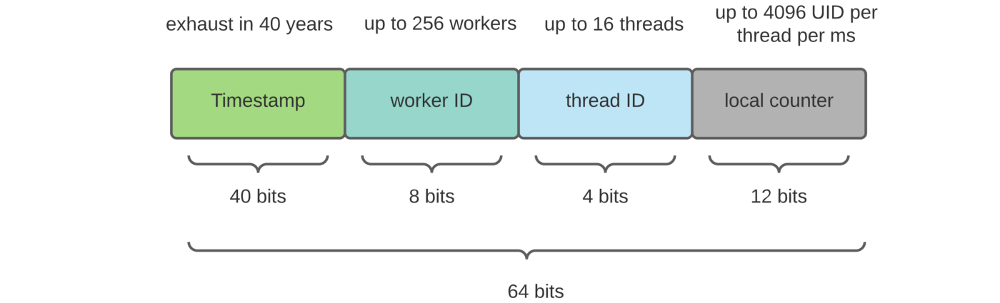

# Algoritmo short url

Como identificador único se decidió utilizar un hash en base 62 (letras y
números). Este hash se genera codificando un número en base 62.

El número base utilizado es un identificador único basado en el timestamp
utilizando un
algoritmo inspirado
en [Twitter Snowflake](https://blog.twitter.com/2010/announcing-snowflake) que
se encarga de generar un
número único para cada registro.

El identificador generado tiene una estructura similar a la siguiente

Aunque la cantidad de bits utilizados es menor.

Para la implementación del código se utilizó la
librería [Snowflake-UUID](https://github.com/rakheyl/snowflake-uuid) para
realizar el cálculo del identificador snowflake.

Esto está generando hash únicos similares al siguiente después de hacer la
codificación en base 62: `hxT2nmtIrK`

Si se necesitarán menos caracteres para el hash, se puede realizar una
implementación
personalizada de la librería o ir ajustando los parámetros de la librería.

#### Ventajas

- No se requiere una base de datos para almacenar los identificadores o un
  contador
  global.
- No se tiene que preocupar por la cantidad de registros que se generen. La
  operación de generar un identificador es constante.

#### Desventajas

- El identificador generado es predecible. Si se conoce el timestamp del
  registro se puede predecir el identificador generado.
- Se requiere de pasar correctamente los parámetros que entregan la
  característica
  de único del identificador. Como lo son el worker id y el datacenter id (en la
  librería utilizan el datacenter id en vez del thread id que se ve en la
  imagen).

## Opciones que se consideraron

Las siguientes opciones se tomaron en cuenta para la generación del hash:

### Generar el hash de manera aleatoria

- Se generan X caracteres aleatorios y se verifica que no exista en la base de
  datos.
- Si existe, se vuelve a generar el hash.
- Si no existe, se guarda en la base de datos.

#### Ventajas:

- Es la opción más sencilla de implementar.
- No requiere de un algoritmo de hash o enconding.

#### Desventajas:

- Los costos de generar un hash único aumentan a medida que la base de datos
  crece.
- Los tiempos de respuesta aumentan a medida que la base de datos crece.
- Cada vez cuesta más encontrar un hash único.

#### Escalar esta opción

Para escalar esta opción se puede mover esta generación de hash a un servicio
aparte que se encargue de generar los hashes únicos. Este servicio puede ser
escalado de manera independiente a la base de datos.

Por ejemplo podría pre-calcular los hashes y guardarlos en una base de datos.
Luego cuando se le consulté por un hash, se le devolvería el hash que se
encuentre disponible en la base de datos de hashes pre-calculados.

El tema es que no evitas el problema de que cada vez cuesta más encontrar un
hash único. Cada vez es más costoso encontrar un hash único. Necesitas tener
poder de cómputo para generar los hashes aunque lo hagas fuera del hilo de
ejecución principal y el usuario ni se entere.

